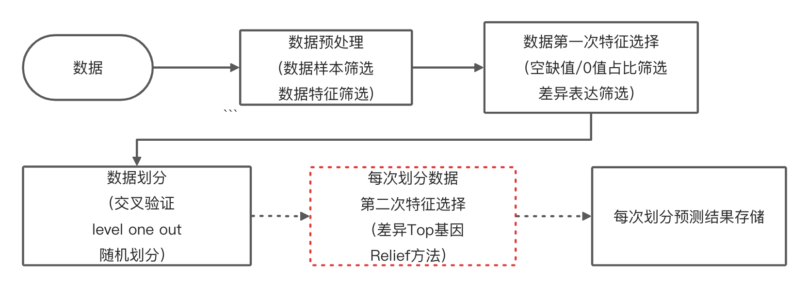

## 机器学习工具

完整的表达数据处理过程，其中主要流程如下图。




工具和数据服务器。

### 1.数据说明
数据路径：/BioII/lulab_b/liuxiaofan/project/Tool/Teach/data
表达矩阵：/BioII/lulab_b/liuxiaofan/project/Tool/Teach/data/NC_CRC_data.txt
标签信息：/BioII/lulab_b/liuxiaofan/project/Tool/Teach/data/NC_CRC_label_data.txt

数据为NC和CRC的表达read count。

### 2.数据预处理
主要是计算每个基因的0值比例，筛选0值占比较少的基因
计算脚本:/BioII/lulab_b/liuxiaofan/project/Tool/Teach/data.py
输入：/BioII/lulab_b/liuxiaofan/project/Tool/Teach/data/NC_CRC_data.txt；/BioII/lulab_b/liuxiaofan/project/Tool/Teach/data/NC_CRC_label_data.txt
输出：/BioII/lulab_b/liuxiaofan/project/Tool/Teach/data/NC_CRC_data_filter.txt；/BioII/lulab_b/liuxiaofan/project/Tool/Teach/data/NC_CRC_filter_label_data.txt

### 3.第一次特征选择
这里我们利用差异表达进行特征筛选，选择差异改变倍数Top300的基因。

* 差异表达计算
计算脚本：/BioII/lulab_b/liuxiaofan/project/Tool/Teach/diff-exp.sh
```
#!/bin/sh

/BioII/lulab_b/chenyinghui/software/conda2/bin/Rscript /BioII/lulab_b/liuxiaofan/project/Tool/Teach/diff-exp.R \
/BioII/lulab_b/liuxiaofan/project/Tool/ROCTool/data/NC_CRC_data_filter.txt  \
/BioII/lulab_b/liuxiaofan/project/Tool/ROCTool/data/NC_CRC_filter_label_data.txt  \
NULL \
CRC  \
NC \
NULL \
1 \
/BioII/lulab_b/liuxiaofan/project/Tool/Teach/result/CRC_DESeq.txt \
```

差异表达脚本：/BioII/lulab_b/liuxiaofan/project/Tool/Teach/diff-exp.R，参数依次为matrix，classes ，samples，positive_class，negative_class，batch，batch_index，output_file_DESeq。

* 表达数据归一化(TMM)
计算脚本：/BioII/lulab_b/liuxiaofan/project/Tool/Teach/normalization.sh
```
#!/bin/sh

/BioII/lulab_b/chenyinghui/software/conda2/bin/Rscript /BioII/lulab_b/liuxiaofan/project/multi_omics/lulab_0517_pair/code/normalization.R  \
/BioII/lulab_b/liuxiaofan/project/Tool/ROCTool/data/NC_CRC_data_filter.txt \
/BioII/lulab_b/liuxiaofan/project/Tool/ROCTool/data/NC_CRC_filter_label_data.txt  \
NULL \
/BioII/lulab_b/liuxiaofan/project/Tool/ROCTool/data/NC_CRC_data_filter_TMM.txt  \
/BioII/lulab_b/liuxiaofan/project/Tool/ROCTool/data/NC_CRC_data_filter_TMM_RUVg.txt
```

归一化脚本：/BioII/lulab_b/liuxiaofan/project/Tool/Teach/normalization.R，参数依次为matrix，classes，batch，output_normalize_file，output_normalize&batch_file

* 选择差异改变倍数Top300的基因
```
import pandas as pd
import numpy as np

data=pd.read_csv('/BioII/lulab_b/liuxiaofan/project/Tool/Teach/data/NC_CRC_data_filter_TMM.txt',sep='\t')
gene_data=pd.read_csv('/BioII/lulab_b/liuxiaofan/project/Tool/Teach/result/CRC_DESeq.txt',sep='\t')
#这里利用map按行处理数据，代替循环
gene_data['log2FC_abs']=gene_data['log2FoldChange'].map(lambda x:abs(x))
gene_data=gene_data.sort_values('log2FC_abs',ascending=False)
feature_list=list(gene_data.index[:300])

data_new=data.loc[feature_list,:]
data_new=data_new.reset_index()
data_new.to_csv('/BioII/lulab_b/liuxiaofan/project/Tool/Teach/data/NC_CRC_data_selected_TMM.txt',sep='\t',index=False)

label_data=pd.read_csv('/BioII/lulab_b/liuxiaofan/project/Tool/Teach/data/NC_CRC_filter_label_data.txt',sep='\t')
label_data=label_data.set_index('sample_id')
label_data=label_data.loc[list(data_new.columns[1:]),:]
label_data.to_csv('/BioII/lulab_b/liuxiaofan/project/Tool/Teach/data/NC_CRC_selected_label.txt',sep='\t',index=False,header=False)
```

这里为了满足后续脚本需求需对数据进行处理。

### 4.交叉验证进行模型训练和预测

计算脚本：/BioII/lulab_b/liuxiaofan/project/Tool/ROCTool/rocplot_shell.py
输入命令：
```
/BioII/lulab_b/liuxiaofan/software/conda3/bin/python3.7 /BioII/lulab_b/liuxiaofan/project/Tool/ROCTool/rocplot_shell.py \
--samplefilepath /BioII/lulab_b/liuxiaofan/project/Tool/Teach/data/NC_CRC_data_selected_TMM.txt \
--samplelabelpath /BioII/lulab_b/liuxiaofan/project/Tool/Teach/data/NC_CRC_selected_label.txt \
--savepath /BioII/lulab_b/liuxiaofan/project/Tool/Teach/result \
--modeltype RF_cv \
--controltype NC \
--type CRC \
--cv_type RepeatedStratifiedKFold \
--RKFold_n_splits 5 \
--RKFold_n_repeats 1 \
--plot no
```

* 参数说明

**1)基本参数**
```

--samplefilepath, type=str, required=True,help='File path of data matrix.The rows are the features,the columns are the samples.The first row is the sample name, and the first column is the feature name.'
--samplelabelpath, type=str, required=True,help='File path of the label of the sample'
--savepath, type=str, required=True,help='File path of the generated image,like "D:/"'
--samplefeature, type=str, default="None",help='File path of feature of data'
--controltype, type=str, default='healthy',help='type name of control'
--type, type=str, default='None',help='type name list of cancer, split by ","'
--datanan, type=float, default=0.0,help='Fill the nan'
```


**2)模型参数**
```
--modeltype, type=str, default='LR',choices=('LR', 'SVM','RF','LR_cv', 'SVM_cv','RF_cv'),help='type of model '
--test_size, type=float, default=0.3,help='test sample proportion'
--sample_weight, default=None,choices=('balanced', None),help='Weights associated with classes.'
--LR_C, type=float, default=1,help='Inverse of regularization strength,smaller values specify stronger regularization'
--SVC_C, type=float, default=1, help='Penalty parameter C of the error term,greater values specify stronger regularization'
--RF_n_estimators, type=int, default=10,help='The number of trees in the forest.'
--RF_max_depth, type=int, default=5,help='The maximum depth of the tree. If None, then nodes are expanded until all leaves are pure or until all leaves contain less than min_samples_split samples.'
--DT_max_depth, type=int, default=5,help='DT_max_depth'
--DT_min_samples_leaf, type=int, default=2,help='DT_min_samples_leaf'
--fdr_num, type=int, default=10,help='number of NPV value and FDR value'
```

**3)交叉验证参数**
```
--cv_type, type=str, default='random',help='cv_type'
--RKFold_n_splits,type=int, default=5,help='RKFold_n_splits'
--RKFold_n_repeats,type=int, default=10,help='RKFold_n_repeats'
--RKFold_random_state,type=int, default=0,help='RKFold_random_state'
```

**4)画图参数**
```
--plot, type=str, default='no',help='plot'
```
